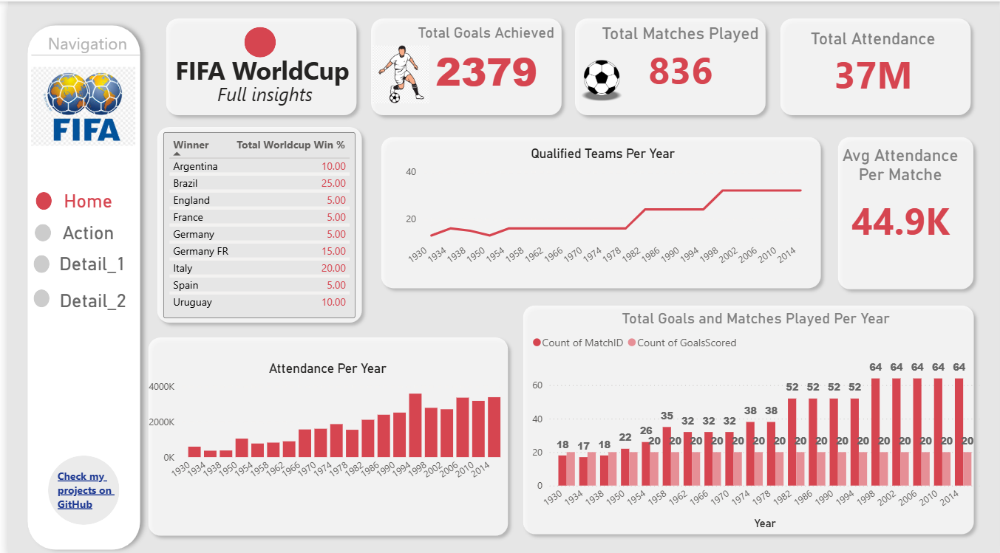
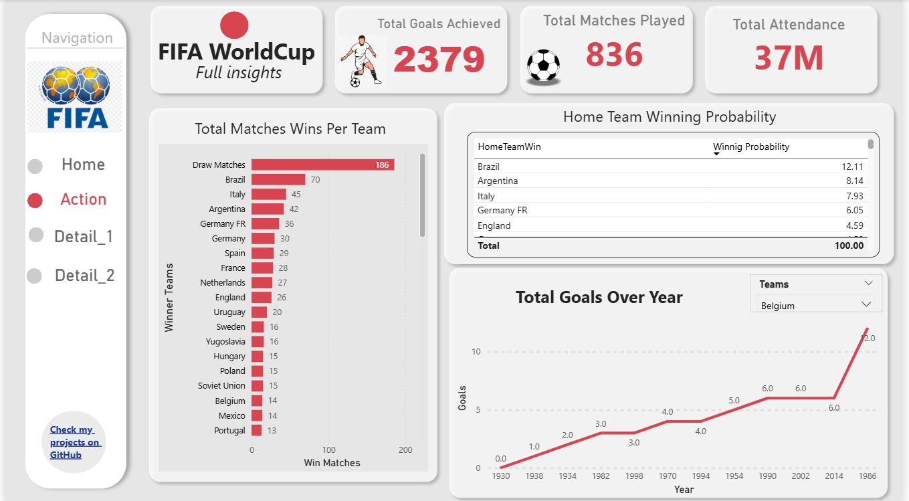
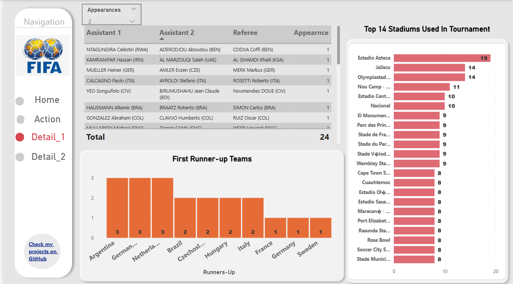
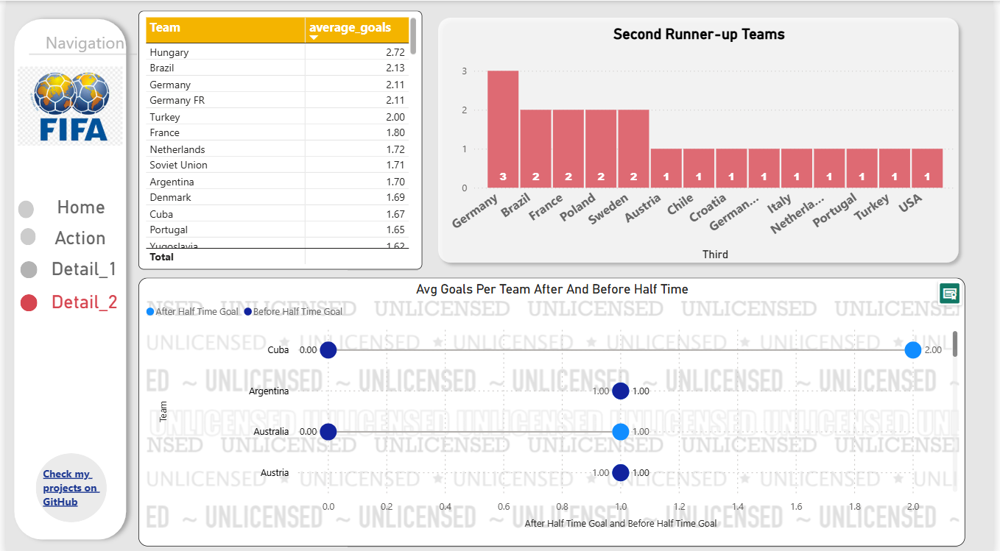

# FIFA Football Data Analysis & Interactive Dashboard

## Overview

This project focuses on analyzing historical FIFA football data to extract meaningful insights and present them through an interactive and visually engaging dashboard. The analysis covers performance metrics, trends over time, and probabilistic insights related to matches and tournaments.

The objective is to transform raw FIFA datasets into actionable insights for better understanding of team performance, audience engagement, and match dynamics.

---

## Problem Statement

FIFA datasets contain large volumes of historical match data, but extracting useful insights manually is time-consuming and inefficient. This project aims to:

* Simplify complex football data
* Identify trends across tournaments
* Analyze team performance and probabilities
* Build an interactive dashboard for decision-making

---

## Key Metrics

* Total Goals Scored
* Total Matches Played
* Total Attendance
* Average Attendance per Match

---

## Analysis & Insights

### Tournament Trends

* Matches played and goals scored per year
* Growth in number of participating teams
* Yearly attendance trends

### Team Performance

* Total titles won by each country
* Runner-up and second runner-up analysis
* Goals scored by teams over time
* Performance in knockout stages

### Probability Analysis

* Probability of home team winning titles
* Match outcome probabilities (win/loss/draw)
* Winning probability in knockout matches

### Player & Match Insights

* Referee participation analysis (interactive filter)
* Match-level insights including assistants and officials

### Stadium Insights

* Top 14 stadiums used in FIFA tournaments
* Venue utilization trends

---

## Dashboard Features

* Interactive filters and slicers
* Dynamic visuals for time-based analysis
* Drill-down capabilities for teams and matches
* User-driven exploration of referee data

---

## Sample Visuals

> Replace with your dashboard screenshots

---

## Project Demo (YouTube)

---

## Tools & Technologies

* Power BI (Dashboard & Visualization)
* Python / Pandas (Data Processing)
* Excel / CSV (Data Source)

---

## Key Outcomes

* Improved understanding of FIFA tournament trends
* Identification of high-performing teams
* Clear visualization of probabilities and match outcomes
* Enhanced decision-making through interactive dashboards

---

## Author

Kamran Khan Orakzai
Data Analyst | Data Science | Mlops

---

## Support

If you find this project useful, consider giving it a star.
